# Review Master - Multi-Project Repository Overview

## Project Summary

Review Master is a comprehensive Google Reviews and Google My Business management platform designed to help businesses automate review collection, analyze customer feedback, and generate monthly reports. The system integrates with Google My Business API to manage reviews across multiple business locations and provides AI-powered insights using OpenAI's GPT models.

## Architecture Overview

The project follows a microservices architecture with 11 independent services managed under one repository:

### Architecture Diagram

```mermaid
flowchart TD
    Actor[👤 Actor/Customer]
    Dispatcher[📋 Dispatcher Systems<br/>CAB9/Cordic/Autocab]
    
    GR[🔗 google_reviews<br/>Webhook Service]
    GRA[🔄 google_reviews_autocab<br/>Polling Service]
    GMB[🤖 google_my_business<br/>AI Analysis & Reports]
    GRU[⚙️ google_reviews_ui<br/>Admin Backend]
    RCP[🔐 rm_client_portal<br/>Client Backend]
    
    SMS[📱 send_sms<br/>SMS Gateway]
    SMSU[📝 send_sms_ui<br/>SMS Web Interface]
    LOG[📋 log_viewer<br/>Log Monitoring]
    EMAIL[📧 send_email_check<br/>Email Maintenance]
    
    GRFE[🖥️ google_reviews_fe<br/>Admin Frontend<br/>Vue 2 + Quasar]
    RCPFE[📊 rm_client_portal_fe<br/>Client Frontend<br/>Vue 3 + Quasar + TS]
    
    DB[(🗄️ MySQL Database)]
    GMBPage[🌟 Google My Business]
    
    %% Main Data Flow
    Dispatcher -->|"Webhooks (CAB9/Cordic)"| GR
    Dispatcher -->|"Polling (Autocab)"| GRA
    GR --> SMS
    GRA --> SMS
    SMS -->|"Review request SMS"| Actor
    Actor -->|"Leaves review"| GMBPage
    
    %% Background Processing
    GMB -->|"Monthly analysis<br/>PDF reports<br/>Email delivery"| DB
    
    %% Admin Interface
    GRFE --> GRU
    GRU --> DB
    
    %% Client Portal
    RCPFE --> RCP
    RCP --> DB
    
    %% Supporting Services
    SMSU --> SMS
    LOG -.->|"Monitors"| GR
    LOG -.->|"Monitors"| GMB
    EMAIL -.->|"Maintains"| GMB
    
    %% Database Connections
    GR --> DB
    GRA --> DB
    GMB --> DB
    
    %% Styling
    classDef core fill:#e1f5fe,stroke:#01579b,stroke-width:2px
    classDef frontend fill:#f3e5f5,stroke:#4a148c,stroke-width:2px
    classDef support fill:#fff8e1,stroke:#f57c00,stroke-width:2px
    classDef external fill:#fff3e0,stroke:#e65100,stroke-width:2px
    classDef database fill:#e8f5e8,stroke:#2e7d32,stroke-width:2px
    
    class GR,GRA,GMB,GRU,RCP core
    class GRFE,RCPFE frontend
    class SMS,SMSU,LOG,EMAIL support
    class Actor,Dispatcher,GMBPage external
    class DB database
```



## Core Services

### Backend Services (Go)

#### 1. google_reviews
**Purpose**: Webhook receiver for dispatcher integrations (CAB9, Cordic)
- REST API endpoints for booking completion webhooks
- SMS gateway integration for review requests
- Rate limiting and telephone number validation
- Statistics tracking and logging
- Entry point: `google_reviews.go`

#### 2. google_reviews_autocab
**Purpose**: Polling-based integration for Autocab dispatcher systems
- Continuous polling of Autocab APIs (v1, v2 support)
- Archive booking processing for completed rides
- Same SMS gateway integration as webhook service
- Entry point: `google_reviews_autocab.go`

#### 3. google_my_business
**Purpose**: AI-powered review analysis, automated replies, and monthly reporting
- OAuth 2.0 Google My Business API integration
- **Automated review replies**: AI-generated responses via OpenAI GPT-4
- **Template-based fallback responses** for different star ratings
- **Dual response strategy**: AI primary, templates fallback
- Monthly PDF report generation with insights and trends
- Automated email delivery via SendGrid
- Entry points: `my_business.go`, `cmd/run_monthly_analysis/main.go`

#### 4. google_reviews_ui
**Purpose**: Admin backend API for management interface
- RESTful API for client and configuration management
- User authentication and authorization
- Statistics aggregation and reporting
- Entry point: `google_reviews_ui.go`

#### 5. rm_client_portal
**Purpose**: Client-facing portal backend
- Google OAuth2 authentication for clients
- Report viewing and downloading APIs
- Monthly analytics data access
- Entry point: `rm_client_portal.go`

### Supporting Infrastructure (Go)

#### 6. send_sms
**Purpose**: Centralized SMS gateway service
- HTTP API for SMS message sending
- Multiple provider support with load balancing
- Rate limiting and abuse prevention
- GSM character encoding and validation
- Entry point: `send_sms.go`

#### 7. send_sms_ui
**Purpose**: Web interface for manual SMS sending
- HTML form for bulk SMS sending
- Real-time character counting
- Administrative SMS management
- Entry point: `send_sms_ui.go`

#### 8. log_viewer
**Purpose**: Web-based log monitoring
- Secure log file viewing via HTTPS
- Remote system monitoring without shell access
- Basic authentication for security
- Entry point: `log_viewer.go`

#### 9. send_email_check
**Purpose**: Email connectivity maintenance
- Automated email sending to maintain Google account access
- Prevents "less secure app" setting deactivation
- Cron job utility for system maintenance
- Entry point: `send_email_check.go`

### Frontend Applications (Vue.js/Quasar)

#### 10. google_reviews_fe
**Purpose**: Admin interface for back-office operations
- Vue.js 2 + Quasar Framework
- Client management and configuration
- Statistics dashboard and monitoring
- JWT authentication

#### 11. rm_client_portal_fe
**Purpose**: Client-facing analytics portal
- Vue.js 3 + Quasar + TypeScript
- ApexCharts for data visualization
- Pinia state management
- Report viewing and downloading

## Business Flow

1. **Review Collection**:
   - Dispatcher systems send completion webhooks (CAB9/Cordic) or get polled (Autocab)
   - System validates booking and customer eligibility
   - SMS sent via centralized gateway with Google review link

2. **Review Management**:
   - Google My Business API fetches reviews periodically
   - AI analyzes sentiment and generates contextual responses
   - **Automated reply posting** to Google My Business reviews
   - Dual strategy: AI-generated responses with template fallbacks
   - Per-client configuration for response behavior

3. **Monthly Reporting**:
   - Scheduled analysis runs 1st of each month
   - AI generates insights, trends, and competitor analysis
   - PDF reports created and emailed to clients

## Development Commands

### Backend Services (Go 1.16+)
```bash
# Build and test
go build [service_name].go
go test ./...
go test -v -cover

# Cross-compile for Linux deployment
env GOOS=linux GOARCH=amd64 go build [service_name].go

# Database migrations (where applicable)
./run_migrations.sh
```

### Frontend Services

**google_reviews_fe** (Vue.js 2 + Quasar):
```bash
npm run dev         # Development server
npm run build       # Production build
npm run lint        # ESLint
```

**rm_client_portal_fe** (Vue.js 3 + Quasar + TypeScript):
```bash
npm run dev         # Development server
npm run build       # Production build
npm run lint        # ESLint + TypeScript
npm run format      # Prettier formatting
```

### Key Operations

**Monthly Analysis**:
```bash
cd google_my_business/
go run cmd/run_monthly_analysis/main.go --email-summary=admin@example.com
```

**AI Testing**:
```bash
cd google_my_business/
./test_reviews_from_csv.sh reviews.csv
OPENAI_MODEL=gpt-4 ./test_reviews_from_csv.sh reviews.csv
```

**Database Migrations**:
```bash
cd google_reviews/
./run_migrations.sh  # Interactive with backup/restore
```

## Configuration & Deployment

### Technology Stack
- **Backend**: Go 1.16+, MySQL, HTTPS/TLS
- **Frontend**: Vue.js 2/3, Quasar Framework, TypeScript
- **AI/ML**: OpenAI GPT-4 for review analysis
- **APIs**: Google My Business, SendGrid, SMS providers
- **Auth**: JWT tokens, Google OAuth2
- **Infrastructure**: AWS EC2, systemd services

### Security Features
- TLS/HTTPS encryption for all communications
- JWT-based authentication with Google OAuth2
- API token validation and rate limiting
- Telephone number barring and validation
- Database credential encryption

### Deployment
- Each service includes `deploy.sh` and systemd service files
- Automated backup/rollback capabilities
- Multi-tenant SaaS architecture
- Independent service deployment and scaling

This system is production-ready, serving multiple business clients with isolated data and customizable configurations across the transportation industry.