# CLAUDE.md

This file provides guidance to Claude Code (claude.ai/code) when working with code in this repository.

## System Overview

Review Master is a microservices-based Google My Business review management system that automates review collection, AI-powered response generation, and monthly analytics reporting. The system consists of 5 main services: 4 Go backend services and 2 frontend applications.

### Core Services Architecture

**Backend Services (Go 1.16+):**
- `google_reviews/` - Core webhook service that receives booking completion events from dispatchers and triggers SMS review requests
- `google_my_business/` - Background job processor for AI-powered review analysis, monthly reporting, and client-facing analysis reports
- `google_reviews_ui/` - Admin/back office interface backend for CRUD operations on clients and review management
- `rm_client_portal/` - Client portal backend with Google OAuth2 authentication for client-facing dashboard

**Frontend Applications:**
- `google_reviews_fe/` - Vue.js 2 + Quasar admin interface used by back office staff for client management
- `rm_client_portal_fe/` - Vue.js 3 + Quasar client-facing portal with ApexCharts for analytics viewing

**Data Flow:**
1. **Dispatcher** → `google_reviews` (webhook: booking completed)
2. **`google_reviews`** → SMS Gateway (if booking qualifies for review request)
3. **Actor/Customer** receives SMS with Google My Business review link
4. **`google_my_business`** processes background jobs (monthly analysis, client reports)
5. **Admin users** manage clients via `google_reviews_fe` + `google_reviews_ui`
6. **Clients** view analytics via `rm_client_portal_fe` + `rm_client_portal`

### Key System Features

- **Webhook-Driven SMS Collection**: Dispatchers send booking completion webhooks to trigger automated SMS review requests to customers
- **AI Review Analysis**: OpenAI-powered monthly review analysis and insights generation with PDF report generation
- **Multi-tenant Architecture**: Per-client configuration, SMS settings, and isolated reporting
- **Background Job Processing**: Scheduled monthly analysis, retry logic, and automated email delivery
- **Dual Interface Design**: Separate admin interface for back office operations and client portal for analytics viewing
- **Review Response Management**: AI-generated responses to Google My Business reviews

### Architecture Diagram

```mermaid
flowchart TD
    Actor[👤 Actor/Customer]
    Dispatcher[📋 Dispatcher]
    
    GR[🔗 google_reviews<br/>Webhook Service]
    GMB[🤖 google_my_business<br/>Background Jobs]
    GRU[⚙️ google_reviews_ui<br/>Admin Backend]
    RCP[🔐 rm_client_portal<br/>Client Backend]
    
    GRFE[🖥️ google_reviews_fe<br/>Admin Frontend<br/>Vue 2 + Quasar]
    RCPFE[📊 rm_client_portal_fe<br/>Client Frontend<br/>Vue 3 + Quasar + TypeScript]
    
    DB[(🗄️ google_reviews<br/>MySQL Database)]
    SMS[📱 SMS Gateway]
    GMBPage[🌟 Google My Business<br/>Review Page]
    
    %% Main Data Flow
    Dispatcher -->|"Webhook: booking completed"| GR
    GR -->|"If booking qualifies for review"| SMS
    SMS -->|"SMS with GMB review link"| Actor
    Actor -->|"Leaves review"| GMBPage
    
    %% Background Processing
    GMB -->|"Monthly analysis<br/>PDF reports<br/>Email delivery"| DB
    
    %% Admin Interface
    GRFE --> GRU
    GRU -->|"CRUD operations<br/>Client management"| DB
    
    %% Client Portal
    RCPFE --> RCP
    RCP -->|"OAuth2 authentication<br/>Analytics viewing"| DB
    
    %% Database Connections
    GR --> DB
    GMB --> DB
    
    %% Styling
    classDef service fill:#e1f5fe,stroke:#01579b,stroke-width:2px
    classDef frontend fill:#f3e5f5,stroke:#4a148c,stroke-width:2px
    classDef external fill:#fff3e0,stroke:#e65100,stroke-width:2px
    classDef database fill:#e8f5e8,stroke:#2e7d32,stroke-width:2px
    
    class GR,GMB,GRU,RCP service
    class GRFE,RCPFE frontend
    class Actor,Dispatcher,SMS,GMBPage external
    class DB database
```



**Key Data Flow:**
1. **Dispatcher** → `google_reviews` (webhook: booking completed)
2. **`google_reviews`** → SMS Gateway (if booking qualifies for review request)
3. **Actor/Customer** receives SMS with Google My Business review link
4. **`google_my_business`** processes background jobs (monthly analysis, client reports)
5. **Admin users** manage clients via `google_reviews_fe` + `google_reviews_ui`
6. **Clients** view analytics via `rm_client_portal_fe` + `rm_client_portal`

## Build and Development Commands

### Backend Services (Go)
All Go services use Go 1.16+ and follow similar patterns:

```bash
# Build locally
go build [service_name].go

# Cross-compile for Linux deployment  
env GOOS=linux GOARCH=amd64 go build [service_name].go

# Run tests
go test ./...
go test -v          # verbose output
go test -cover      # with coverage

# Database migrations (where applicable)
./run_migrations.sh
```

### Frontend Services

**Google Reviews FE** (Vue.js 2 + Quasar webpack):
```bash
npm run dev         # development server (Quasar dev)
npm run build       # production build (Quasar build)
npm run lint        # ESLint
npm run format      # ESLint auto-fix
npm run test        # No test framework configured
```

**RM Client Portal FE** (Vue.js 3 + Quasar Vite + TypeScript):
```bash
npm run dev         # development server (Quasar dev)
npm run build       # production build (Quasar build)
npm run lint        # ESLint with TypeScript support
npm run format      # Prettier formatting
npm run test        # No test framework configured
npm run postinstall # Quasar prepare (auto-runs after npm install)
```

### Testing
- **Go**: Extensive test coverage using standard `testing` package with `testfixtures.v2` for database tests
  ```bash
  go test ./...                    # Run all tests
  go test -v                       # Verbose output
  go test -cover                   # With coverage
  go test ./path/to/package        # Test specific package
  ```
- **AI Testing**: Custom CSV-based review response testing tool in `google_my_business/`
  ```bash
  ./test_reviews_from_csv.sh [csv_file]   # Test AI responses (requires OPENAI_API_KEY)
  # Optional: OPENAI_MODEL=gpt-4 ./test_reviews_from_csv.sh reviews.csv
  ```
- **Frontend**: Test scripts exist but no testing frameworks are currently implemented

## Configuration and Deployment

### Environment Setup
- **OpenAI API Key**: Required for AI features, set via `config.properties` or `OPENAI_API_KEY` environment variable
- **Database**: All services use MySQL with automated migration systems
- **Authentication**: OAuth2 integration for client portal

### Deployment Infrastructure
- **Platform**: AWS EC2 instances (eu-west-2 region)
- **Process Management**: Linux systemd services
- **Deployment**: Automated via `deploy.sh` script with backup/rollback capabilities
- **Database Backups**: Automated backup system integrated with migrations

### Service Management
Each backend service has a corresponding systemd service file in `scripts/[service_name].service`

## Monthly Analysis System

The core business feature is automated monthly review analysis:

- **Scheduler**: Cron job runs 1st of each month at 2 AM UK time
- **Process**: AI analyzes previous month's reviews, generates PDF reports, sends via email
- **Retry Logic**: Failed clients tracked and retried up to 3 times
- **Command**: `go run cmd/run_monthly_analysis/main.go --email-summary=admin@example.com`

## Database Architecture

All services use MySQL with:
- **Migration System**: Numbered SQL files (0_*.sql, 1_*.sql, etc.) with automated backup/restore
  ```bash
  # In google_reviews/ service
  ./run_migrations.sh               # Interactive migration with prompts
  ./run_migrations.sh --no-drop     # Skip database recreation
  ./run_migrations.sh -h localhost -d google_reviews -u root
  ```
- **Test Fixtures**: YAML-based test data management using `testfixtures.v2`
- **Multi-tenant Design**: Client-based data isolation with per-client configurations

## Code Patterns and Conventions

- **Go**: Standard project structure with separate `config/`, `database/`, `server/` packages
  - Configuration via `config.properties` files and Viper library
  - Database connection pooling with MySQL driver
  - Structured logging with Lumberjack for rotation in production
- **Frontend**: 
  - **Vue 2 (google_reviews_fe)**: Quasar framework with Vuex for state management
  - **Vue 3 (rm_client_portal_fe)**: Quasar + Vite + TypeScript with Pinia for state management
  - ApexCharts integration for data visualization
- **Testing**: Database tests use YAML fixtures with `testfixtures.v2`, integration tests cover full request cycles
- **AI Integration**: OpenAI API integration with configurable models (GPT-3.5-turbo, GPT-4)
- **Authentication**: Google OAuth2 for client portal, JWT tokens for session management

## Service-Specific Commands

### Google My Business Service
```bash
# Monthly analysis (core business feature)
go run cmd/run_monthly_analysis/main.go --email-summary=admin@example.com

# Template preview for development
go run cmd/template_preview/main.go

# AI response testing
./test_reviews_from_csv.sh reviews.csv
OPENAI_MODEL=gpt-4 ./test_reviews_from_csv.sh reviews.csv

# Deployment to AWS
./deploy.sh           # Deploy to production
./deploy.sh rollback  # Rollback to previous version
```

### Google Reviews Service  
```bash
# Database migrations
./run_migrations.sh
./db_migration.sh    # Alternative migration script

# Service binary
go build google_reviews.go
env GOOS=linux GOARCH=amd64 go build google_reviews.go  # Cross-compile for Linux
```